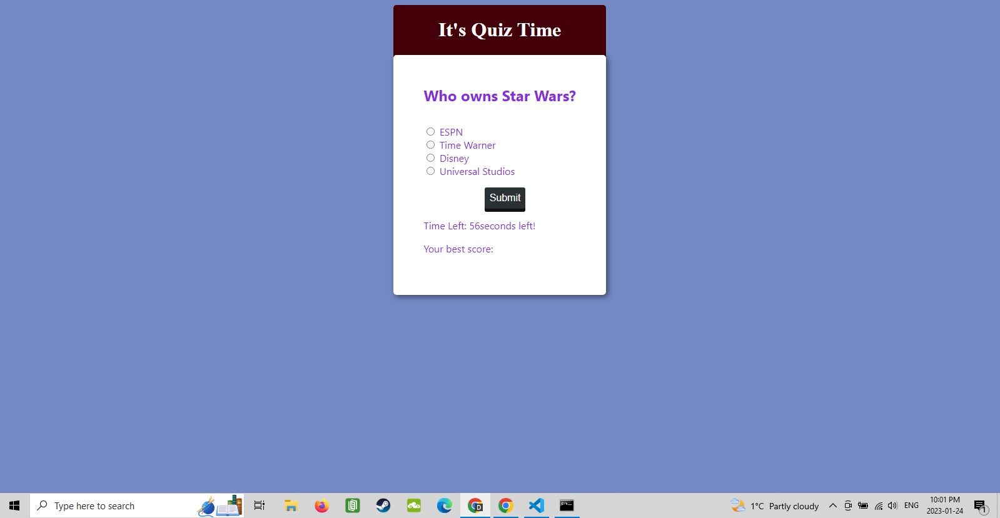
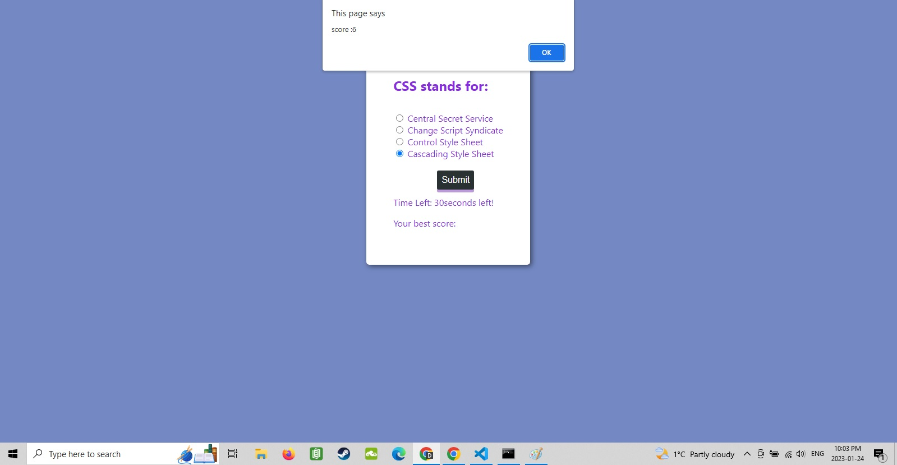

# JavaScript Quiz

## Description

I've been putting this quiz together to demonstrate some new concepts I am learning and perfecting. This is a quick quiz app built on the JS system. I used logged const variables as the questions and referenced their answers as radio outputs. Based on your selected answers, you will be awarded points, which show up at the end in a pop up box. There are a few elements I am still having a hard time getting to understand, but this is a working piece which will help me gain a stronger grasp on JS coding.

## Table of Contents 

- [Installation](#installation)
- [Usage](#usage)
- [Credits](#credits)
- [License](#license)

## Installation

No need for installation, simply open the index file and try to get all the answers right.

## Usage

Once opening the page, the quiz timer will begin. Proceed through the quiz and do your best to answer all 10 questions. Once you finish all the questions, your score will pop up. If you run out of time the quiz will end, you can restart by pressing the submit button again.

    

  
    
 

## Credits

Credit to utoronto.bootcamp for the endless tutorials as well to www.stackoverflow.com for the countless message board articles I consulted in trying to geth code to work together!

## License

MIT License

Copyright (c) 2023 TamasPinter

Permission is hereby granted, free of charge, to any person obtaining a copy
of this software and associated documentation files (the "Software"), to deal
in the Software without restriction, including without limitation the rights
to use, copy, modify, merge, publish, distribute, sublicense, and/or sell
copies of the Software, and to permit persons to whom the Software is
furnished to do so, subject to the following conditions:

The above copyright notice and this permission notice shall be included in all
copies or substantial portions of the Software.

THE SOFTWARE IS PROVIDED "AS IS", WITHOUT WARRANTY OF ANY KIND, EXPRESS OR
IMPLIED, INCLUDING BUT NOT LIMITED TO THE WARRANTIES OF MERCHANTABILITY,
FITNESS FOR A PARTICULAR PURPOSE AND NONINFRINGEMENT. IN NO EVENT SHALL THE
AUTHORS OR COPYRIGHT HOLDERS BE LIABLE FOR ANY CLAIM, DAMAGES OR OTHER
LIABILITY, WHETHER IN AN ACTION OF CONTRACT, TORT OR OTHERWISE, ARISING FROM,
OUT OF OR IN CONNECTION WITH THE SOFTWARE OR THE USE OR OTHER DEALINGS IN THE
SOFTWARE.
---